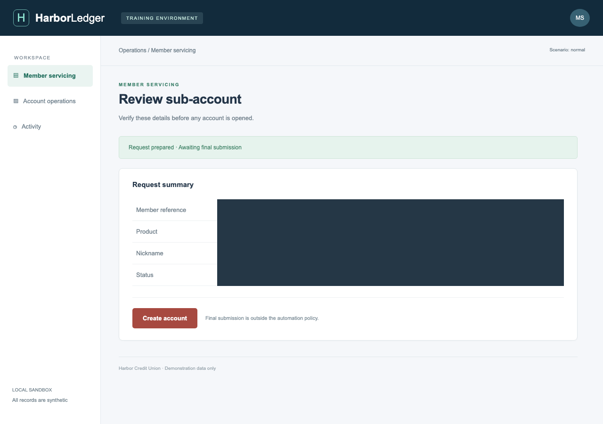
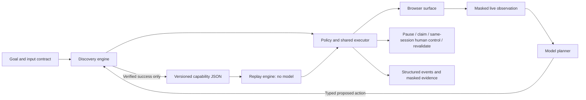

# Computer-Use Capabilities

**Discover a UI workflow once. Invoke its typed capability without a model afterward.**

A small computer-use backend for a synthetic legacy banking application: real browser actions,
versioned capabilities, deterministic replay, policy enforcement, and human control of the same live session.

> **Verified:** Gemini completed genuine live discovery in seven model calls. Its generated capability
> replayed successfully with different inputs and **zero model calls**. The local suite passes **85 tests**,
> lint, formatting, and strict typing. Inspect the [evidence index](evidence/README.md) and [report](REPORT.md).



## Start here

Requirements: Python 3.12, [uv](https://docs.astral.sh/uv/getting-started/installation/), and a supported
macOS or Linux desktop for manual takeover. Headless replay/tests also run on Linux CI. All application
records are fictional. No cloud service or API key is needed for replay, tests, or the offline demo.

```bash
uv sync --locked --extra dev
export PLAYWRIGHT_BROWSERS_PATH="$PWD/.browser-cache"
uv run playwright install chromium
# Linux only, if browser system libraries are missing:
# uv run playwright install --with-deps chromium
```

Start the sandbox in terminal A:

```bash
uv run capabilities sandbox
```

In terminal B, replay the capability generated by the recorded live Gemini run with different inputs:

```bash
export PLAYWRIGHT_BROWSERS_PATH="$PWD/.browser-cache"
uv run capabilities replay \
  --artifact evidence/live/discover-2acef308bd9c/capability.json \
  --inputs '{"member_id":"10042","product":"Checking","nickname":"Travel Fund"}' \
  --show-outputs
```

The UI searches the member, opens a sub-account form through a canvas control, fills the form,
and verifies the review page. It stops before account creation. Successful caller output includes:

```json
{
  "status": "success",
  "outputs": {
    "member_id": "10042",
    "product": "Checking",
    "nickname": "Travel Fund",
    "review_ready": true
  },
  "model_calls": 0
}
```

`--show-outputs` explicitly releases declared outputs to the caller's stdout. Without it, stdout
redacts all output values. Saved results always redact fields classified sensitive by the contract.
Do not redirect raw caller output into public evidence. Each run prints its evidence directory to stderr.

## Genuine discovery → saved artifact → replay

This path calls a real model and consumes API quota. The checked-in successful run used
`gemini-3.1-flash-lite`; [its events](evidence/live/discover-2acef308bd9c/events.jsonl) include response
IDs and usage for all seven decisions. Earlier failed attempts are retained and indexed in the evidence
manifest. Anthropic transport is tested with fixtures; its live attempt stopped for insufficient credit.
Choose either provider; there is no automatic provider fallback.

### Gemini (free-tier option)

Create a key in [Google AI Studio](https://aistudio.google.com/apikey) using a project on the free tier.
Add `GEMINI_API_KEY=...` to the ignored `.env` file; keep real credentials out of chat and Git.
Google lists a [free tier](https://ai.google.dev/gemini-api/docs/pricing) for selected Flash models,
subject to eligibility and quota. Free-tier content may be used to improve Google's products: this demo
uses only synthetic data and masked observations. Do not enable paid billing just to run this example.

```bash
uv run capabilities discover --provider gemini \
  --goal 'Find the supplied member, prepare the requested sub-account with the supplied nickname, and stop at the review screen.' \
  --contract examples/prepare-subaccount.goal.json \
  --inputs '{"member_id":"10023","product":"Savings","nickname":"Emergency Fund"}' \
  --evidence evidence/live
```

The default is `gemini-3.1-flash-lite`; override with `--model` or `CAPABILITIES_GEMINI_MODEL`.
Requests are spaced at least 13 seconds apart to accommodate small quotas. A quota rejection stops
with `model_rate_limited`; no automatic retries, billing changes, or paid-provider fallback occur.
The provider reads the masked screenshot and returns a JSON decision checked against the same contract.

### Anthropic

1. Create an API key following [Anthropic's setup guide](https://platform.claude.com/docs/en/get-started).
2. Copy `.env.example` to `.env`, fill `ANTHROPIC_API_KEY`, and optionally change `CAPABILITIES_MODEL`.
   The CLI loads these variables without executing shell code. `.env` is ignored by Git.
3. Keep the sandbox running and execute:

```bash
uv run capabilities discover \
  --provider anthropic \
  --goal 'Find the supplied member, prepare the requested sub-account with the supplied nickname, and stop at the review screen.' \
  --contract examples/prepare-subaccount.goal.json \
  --inputs '{"member_id":"10023","product":"Savings","nickname":"Emergency Fund"}' \
  --evidence evidence/live
```

The model sees a masked live screenshot, currently available policy-approved controls, and the typed
input/output contract. It chooses the action sequence. No successful action sequence is supplied to the
model. Parameter values are bound by the executor, rather than embedded in the artifact.

The command prints an evidence directory such as `evidence/live/discover-<run-id>`. Use the **actual**
printed directory in the next command:

```bash
uv run capabilities replay \
  --artifact evidence/live/discover-<run-id>/capability.json \
  --inputs '{"member_id":"10077","product":"Checking","nickname":"Travel Fund"}' \
  --evidence evidence/live
```

A capability is written only after independently verified success. If discovery needed manual UI work,
the goal can complete, but publication is withheld: unknown manual operations cannot silently become
an unattended capability. Rediscover the complete path before publishing it.

## Human takeover

Run this from a desktop session:

```bash
uv run capabilities replay \
  --artifact examples/authored-capability.json \
  --inputs '{"member_id":"10042","product":"Savings","nickname":"Emergency Fund"}' \
  --scenario session_expired --headed
```

1. Open the printed operator URL, normally `http://127.0.0.1:8766`.
2. The run pauses at **Session expired**. Click **Claim session** in the operator page.
3. In the **existing Chromium window**, click **Restore session**. No credentials are needed in this fixture.
4. Click **Return to automation**. The runner waits for the expected state and resumes the same session.

Use `--scenario unexpected_dialog` to try the acknowledgement path. The control epoch rejects stale
claim/resume requests. Automation cannot dispatch while the owner is `human`. Premature handback is
rejected, preserving the session. A five-minute intervention timeout and an abort action bound the wait.
Headless mode returns `intervention_required` with evidence, instead of silently hanging.

The operator console is local-only, protected against cross-origin control and DNS rebinding. It is a
single-user demonstration, not a production authenticated support console. See [REPORT.md](REPORT.md).

## Runtime outcomes

Pass `--scenario <name>` to discovery or replay. The normal fixture includes members `10023`, `10042`,
and `10077`; any other valid five-digit ID returns `member_not_found`.

| Scenario | Deliberate response |
|---|---|
| `normal` | Verify all declared outputs at the review checkpoint |
| `slow` | Bounded navigation/checkpoint waiting |
| `interstitial` | Dismiss only the known service notice |
| `validation` | Typed `validation_error` business outcome |
| `permission_denied` | Terminal authorization failure |
| `app_error` | Terminal application failure |
| `session_expired` | Same-session operator takeover |
| `unexpected_dialog` | Same-session operator acknowledgement |
| `ambiguous` | Reject duplicate action targets; request intervention |
| `visual_missing` | Reject missing visual anchor; request intervention |
| `prompt_injection` | Page text has no authority to alter policy |

`success`, `business_outcome`, and `failure` are distinct terminal results. A paused intervention is a
session lifecycle state, not a fourth terminal result. CLI exit status is 1 for execution failure and
2 for invalid setup; inspect the JSON `status` and `outcome` for business results.

## Verify and reproduce evidence

```bash
make verify
# Real browser runs, scripted planner/operator, no external API requests:
uv run python scripts/offline_evidence.py --out runs/my-offline-evidence --repetitions 10
# Required deliverables, including the genuinely live discovery gate:
make submission-check
```

Choose an empty output directory; evidence is never overwritten. The submission check passes against
the included live discovery and matching replay. It rejects fixture-only evidence. `make verify` also
works during offline development without requiring a new model run.

The test suite covers schema validation, action policy, real browser replay, exceptional states,
provider response validation, input/output redaction, visual targeting, same-session takeover, CSRF,
stale ownership requests, and checkpoint verification. GitHub Actions runs these tests and validates
the checked-in submission evidence without secrets or new model calls. Recorded measurements and
limitations are indexed in [evidence/README.md](evidence/README.md).

## Read the code

| Module | Responsibility |
|---|---|
| `contracts.py` | Versioned capability, typed references, targets, decisions, and results |
| `discovery.py` | Provider adapter, bounded observe/decide/act loop, successful-run compiler |
| `gemini.py` | Gemini vision transport and response schema restricted to observed controls |
| `engine.py` | Shared executor, business outcomes, checkpoints, model-free replay |
| `surface.py` | Surface protocol; Playwright adapter and bounded visual targeting |
| `policy.py`, `profiles/harbor.json` | Operator-owned action and navigation permissions |
| `session.py`, `operator.py` | Control ownership, takeover, validation, and local operator page |
| `evidence.py` | Allowlisted event records, redaction, atomic artifact writes |
| `sandbox/` | Separate synthetic application; never imported by the execution engine |

The report uses the assignment's seven requested headings. Additional trade-off explanations are in
[docs/DECISIONS.md](docs/DECISIONS.md). The implementation intentionally does not include queues,
clusters, a database service, or a general-purpose browser agent framework.

For a step-by-step acceptance walkthrough, see [docs/TESTING.md](docs/TESTING.md).



## Configuration and limits

- Python/package versions are locked in `uv.lock`; Playwright downloads its matching Chromium build.
- Visual replay uses a 1280×900 viewport, DPR 1, and a static, non-sensitive anchor. A missing or duplicate
  match fails closed. It does not promise resistance to arbitrary theme, zoom, or DPI changes.
- The default profile permits only the sandbox's origin, enumerated routes, and six action rules.
  Final submission is absent from the network allowlist. Permissions are not supplied by the model.
- Discovery defaults to 35 decisions, 180 seconds of active execution, and an observed-token budget.
  In-flight provider usage can exceed the token threshold by one request; it is not a dollar cap.
- Browser-native alert/confirm/prompt dialogs are cancelled and reported as hard failures; the supported
  live handoff demonstration uses HTML dialogs and expired-session screens.
- Screenshots are masked for this application profile. Unknown screens get a structural evidence file.
  No browser trace, cookie dump, raw model transcript, or raw browser exception is persisted.
- Provider failures have stable codes such as `model_billing_required`, `model_authentication_failed`,
  and `model_rate_limited`; raw provider error bodies are never written to evidence.
- The local `.env` loader recognizes only the keys shown in `.env.example`; exported environment
  variables take precedence. `CAPABILITIES_BROWSER_CHANNEL=chrome` can use installed Chrome, but the
  pinned Playwright build is recommended for reproducibility.
- Keep real credentials and customer data out of this demonstration. Production redaction, identity,
  retention controls, remote session isolation, and vendor qualification require further work.

Built with AI-assisted development; the source, tests, evidence provenance, and design limits are
intended to make every claim inspectable.
