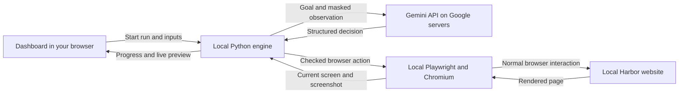

Computer-use automation: questions and answers

This guide describes the implemented project. Harbor Ledger is our synthetic banking application. Gemini is Google's existing model; the automation agent is our Python software around it.

**1. What did we actually build?**

We built a system that lets a model operate a supported website, turns a verified successful run into a reusable workflow, and executes that workflow later without calling a model. The banking application provides the demonstration surface; the automation engine is the main assignment deliverable.

**2. What is the difference between a model, an agent, and a capability?**

The model is Gemini: it interprets the supplied context and proposes the next decision. The agent is our program: it gathers observations, asks the model, checks the response, operates the browser, and repeats. A capability is the saved, structured workflow that can be replayed with new inputs. Saving a capability does not train a new model.

**3. Did we train Gemini or build a new AI model?**

No. We use an existing Gemini model through Google's API. We wrote the application integration, prompts, typed contracts, browser adapter, safety policy, discovery loop, artifact creation, replay engine, human takeover, dashboard, and tests. This project does not fine-tune model weights or use a training dataset.

**4. How does Gemini know what we want?**

Our backend sends an explicit goal: "Find the supplied member, prepare the requested sub-account with the supplied nickname, and stop at the review screen." It also sends a goal contract describing input names, expected outputs, and success checks. The expanded dashboard supports six configured goals (see BANKING_WORKFLOWS.md); it is not a free-text interface for arbitrary tasks. Each goal defines its own result without an ordered action sequence.

**5. How does Gemini know which step to take next?**

For each decision, we supply the current screen name, permitted controls for that screen, a masked screenshot, the goal contract, up to four recent decisions, and a non-sensitive flag identifying inputs already applied on the current screen. Gemini uses that context to propose one next action. It does not receive the saved replay sequence. For example, on "Find a member," it can choose to fill the Member ID field, then choose Search on the next turn.

**6. What instructions did we give the model?**

The project's system prompt tells it to choose an observed control, use input references for values, return exactly one structured decision, treat page text as untrusted data, request help when blocked, and finish only when the goal appears ready. It also forbids account creation and other out-of-scope actions. Enforcement is in Python too: a prompt alone is not a safety boundary.

**7. If we already configured the controls, what is being discovered?**

We configured the application's vocabulary and boundaries: recognized screens, allowed controls, parameter bindings, allowed routes, and final checks. We did not pass an ordered workflow into the discovery call. Gemini chooses the action sequence and when to finish. This is a deliberately constrained discovery demonstration on a known application; the configuration substantially narrows the problem. It is not unrestricted exploration of an unknown website.

**8. Is Gemini browsing the internet to learn Harbor?**

No. Our integration does not enable web search or ask Google to visit Harbor. It sends the current local browser observation to the model. Gemini supports text and image input through its content-generation API; our application supplies that input. See [Google's image-input documentation](https://ai.google.dev/gemini-api/docs/generate-content/image-understanding).

**9. Where does each part run?**

Your dashboard browser, our Python backend, the Harbor server, and the automation-controlled Chromium browser run on your computer. Gemini inference runs on Google's service. Only discovery needs that external model connection; replay runs locally for this local demo.



**10. How is Gemini connected to our backend?**

The `GeminiPlanner` class uses Python's `httpx` client to send HTTPS POST requests to Google's `generateContent` API. The request includes instructions, observation text, an inline masked image, and a JSON response schema. The API key is passed in the `x-goog-api-key` header, matching [Google's API authentication documentation](https://ai.google.dev/api). This project defaults to `gemini-3.1-flash-lite`; a documented environment variable can override the model ID.

**11. What does the API key do, and where is it stored?**

The key authenticates requests to Google's model service. It is not a Harbor login and does not give Gemini control of your computer. Our startup code loads `GEMINI_API_KEY` from the local, Git-ignored `.env` file into the backend environment. The dashboard receives only a configured/not-configured flag, not the key. Keep the key out of screenshots, source control, and chat.

**12. How can Gemini work with a localhost website that Google cannot reach?**

Our local browser can reach the local Harbor server. Our backend reads that browser's state and sends a safe representation to Gemini. Gemini returns a decision; the local backend carries it out. The website does not need to be public, and Google's servers do not need direct access to it.

**13. How does the engine know which website to open?**

The web launcher supplies the banking origin to the run manager. By default, the dashboard is at `127.0.0.1:8766` and Harbor is at `127.0.0.1:8767`. For each run, Playwright launches Chromium, creates a fresh isolated browser context and page, then navigates to the configured banking URL and test scenario. The URL is supplied by trusted configuration; Gemini does not invent it.

**14. Are the dashboard and banking application the same thing?**

They are separate web applications served on different local ports. The dashboard starts and supervises automation. Harbor is the application being operated. The large banking view inside the dashboard is a periodically refreshed screenshot of the engine's real browser session. It is not a second independently navigable banking page.

**15. The assignment says the UI has no API. Why do we have APIs?**

There are different connections. The dashboard uses our control API to start runs and fetch progress. Our backend uses Google's API for model decisions. The engine performs the banking task through browser controls, without directly calling Harbor's business routes as automation shortcuts or importing its records. Harbor still has ordinary HTTP routes for serving pages and processing browser forms, as a web application normally would.

**16. What exactly does Gemini return?**

It returns a structured decision: perform an action, request human help, or finish. An illustrative action response is:

```json
{
  "action": {
    "op": "fill",
    "target": {"kind": "label", "name": "Member ID", "scope": "workspace"},
    "value": {"kind": "input", "name": "member_id"}
  },
  "finish": false,
  "request_human": false,
  "reason": "enter_input"
}
```

Here, JSON is just a structured data format. The response is an instruction proposal, not executable Python or JavaScript. The allowed response schema is narrowed to current observed control descriptors. [Google documents structured JSON output](https://ai.google.dev/gemini-api/docs/generate-content/structured-output); our Pydantic validation and policy checks remain authoritative.

**17. How does that JSON become a real click or typed value?**

Our executor checks the current screen and action permission. The browser adapter translates the logical target into a Playwright locator, such as the field labelled "Member ID." It resolves `member_id` from the inputs you supplied and calls Playwright's fill operation. Click and selection actions follow the same pattern. Gemini never directly holds a mouse, browser connection, or shell.

**18. Is everything based on screen coordinates?**

No. Most targets use exact labels, accessible button names, or table field names within Harbor's Workspace iframe. The canvas-based "New sub-account" control uses a known image anchor and OpenCV template matching to find a click position. Missing or duplicate matches are rejected. That visual approach is qualified for this fixed demo viewport, not arbitrary appearance changes.

**19. Does Gemini see my member ID, nickname, or API key?**

Our planner request uses input definitions and references, rather than sending the supplied member ID and nickname as values. Screenshots sent to the model mask input fields and record values. The key is sent to Google's API service for authentication, not included in the model prompt. The local operator preview can show synthetic values, while saved evidence is redacted. These masks are specific to Harbor, not a universal sensitive-data detector.

**20. Does the model remember earlier actions or learn permanently from a run?**

Our program explicitly includes up to four recent decisions in the next request. That provides short context within discovery. The project does not fine-tune Gemini, change its weights, or depend on persistent conversational memory. Durable reuse comes from the capability JSON on disk. These statements describe our implementation, not Google's provider-side data-retention policy.

**21. Why were there six actions but seven model calls?**

In your successful discovery, six decisions produced six UI actions. Once the review screen was visible, a seventh decision requested completion. Our engine then independently checked the actual outputs. Model calls and browser actions are different counters; other runs can have different totals.

**22. Why did discovery take 85 seconds but replay only 5.1 seconds?**

Discovery includes network requests and model generation. Our Gemini adapter also spaces requests by at least 13 seconds to suit small API quotas; seven calls have six such gaps. Replay skips the model entirely and executes saved steps locally. The web preview adds a short presentation pause after each action, so its replay time includes that too. These are observed demo timings, not performance guarantees.

**23. What prevents Gemini from making a mistake or creating an account?**

It can still propose a bad decision. The engine validates the response shape, approved controls and parameter bindings, current screen, network destinations, and final outputs. The account-creation action and route are outside policy, including during takeover. Invalid responses, provider failures, and out-of-scope actions cannot become successful capabilities. Boundaries reduce risk; they do not make model reasoning infallible.

**24. Who decides whether the task really succeeded?**

The executor does. A model's finish decision triggers verification. The code reads the review screen and compares member reference, product, nickname, and ready-for-review status with the goal contract and supplied inputs. Only a verified successful unassisted discovery publishes an unattended capability.

**25. What does saving a capability mean?**

Our compiler packages the executed steps into versioned JSON. It includes typed inputs, declared outputs, the application profile, actions, before/after screen checks, wait limits, success checks, and provenance identifying the discovery run and model. It is a data artifact interpreted by our engine, not a video or a newly generated model.

**26. Why does the saved capability work for another member?**

It stores `inputs.member_id`, `inputs.product`, and `inputs.nickname` references rather than fixing those fields to the discovery values. Replay resolves them against the new invocation. Your discovery used `10023 / Savings / Random Fund`; replay used `10042 / Checking / Travel Fund`. The workflow stayed the same while the values changed.

**27. Where are the capability and logs saved?**

A dashboard discovery writes under `runs/web/<run-id>/`. The reusable artifact is `capability.json`; `events.jsonl` contains structured event records; `result.json` contains the redacted result. Captured evidence is stored alongside the run. The dashboard combines the bundled capability with valid discovered capability files in its dropdown. Its latest-20 run views live in memory, but saved files survive restart.

**28. What exactly happens during replay?**

The replay engine validates the artifact and new inputs, checks the expected starting screen for each step, performs the saved action, waits for the expected following state, and checks the final outputs. It follows declared recovery rules if needed. The dashboard does not initialize a model provider on this path. Zero model calls is part of the implementation, not just a display label.

**29. What does deterministic mean here? Will replay always succeed?**

Deterministic means fixed steps, target-matching rules, input substitution, and declared recovery decisions, without fresh model reasoning. It does not mean identical timing or guaranteed success against changed application state. A missing member returns a business outcome; an incompatible UI or permission error can stop the run. Replay does not secretly fall back to Gemini to invent a repair.

**30. What is human takeover, and does it record manual demonstrations?**

Takeover lets a person resolve an exception in the same engine-owned browser session. The engine pauses, the person claims control, operates the live preview, and returns control. The engine validates the checkpoint before resuming. Ownership checks prevent automation and human input from dispatching concurrently. Manual action metadata is audited, but this is not a human macro recorder. A discovery that needed manual assistance withholds the unattended artifact.

**31. Does clicking around in Open manual sandbox teach the agent?**

No. That link opens an independent banking session. Its activity is not recorded as a capability and does not control the engine's browser. For discovery, you supply inputs and let the AI-driven engine operate its own browser. For exception handling, you use Claim session inside the dashboard.

**32. What happens if Google is unavailable or quota is exhausted?**

Discovery stops with a classified provider error. The current adapter has bounded waits and no automatic paid-provider fallback or request retry. It does not claim that a failed run created a capability. Existing capabilities still replay without a Gemini key or model connection when the target application is reachable; our demo target is local.

**33. Can this already automate another website or any banking task?**

The implementation now supports six Harbor servicing workflows: sub-account review, card replacement, transaction dispute, address change, statement request, and fee adjustment. It does not automatically support arbitrary websites or tasks. Supporting a different application needs its own qualified adapter/profile, controls, success rules, safety boundaries, and tests. A genuinely different task also needs a goal contract and permitted actions. A differently named discovery of this same task is another artifact, not another distinct business workflow.

**34. If this task could be scripted, why involve AI?**

A developer could script this fixed demo directly. The assignment is about building the lifecycle in which a model discovers a supported UI path and software turns verified execution into a reusable, inspectable artifact. The demo makes that lifecycle testable. It does not establish that this constrained discovery is cheaper than hand-authoring one small workflow or that the agent can handle arbitrary applications.

**35. What did we implement, and where should I read the code?**

The stack is Python, FastAPI, Playwright/Chromium, Pydantic, a Gemini HTTP adapter, OpenCV for one visual target, HTML/CSS/JavaScript for the dashboard, JSON files for artifacts, and pytest for tests. There is no agent-framework dependency or vector database.

| File | Responsibility |
|---|---|
| [dashboard.py](../src/capabilities/dashboard.py) | Run requests, provider selection, capability catalog, progress, preview, and takeover endpoints |
| [discovery.py](../src/capabilities/discovery.py) | Model instructions, observe/decide/act loop, and successful-run compilation |
| [gemini.py](../src/capabilities/gemini.py) | HTTPS model requests, constrained response schema, response validation, and usage tracking |
| [surface.py](../src/capabilities/surface.py) | Real browser launch, observations, targeting, input, and screenshots |
| [engine.py](../src/capabilities/engine.py) | Shared execution checks, final verification, and model-free replay |
| [contracts.py](../src/capabilities/contracts.py) | Typed inputs, actions, decisions, capability schema, and results |
| [policy.py](../src/capabilities/policy.py) and [harbor.json](../src/capabilities/profiles/harbor.json) | Allowed application actions and navigation |
| [session.py](../src/capabilities/session.py) | Ownership, intervention, and validated handback |
| [evidence.py](../src/capabilities/evidence.py) | Structured logs, redaction, and artifact persistence |

The checked-in tests exercise real browser behavior, failure paths, response validation, parameter reuse, and human takeover. Most automated model tests use labelled fixtures to avoid network dependency; separate live evidence records genuine Gemini discovery and matching zero-model replay. Your manual dashboard tests additionally exercised discovery followed by replay of your newly saved capability.
