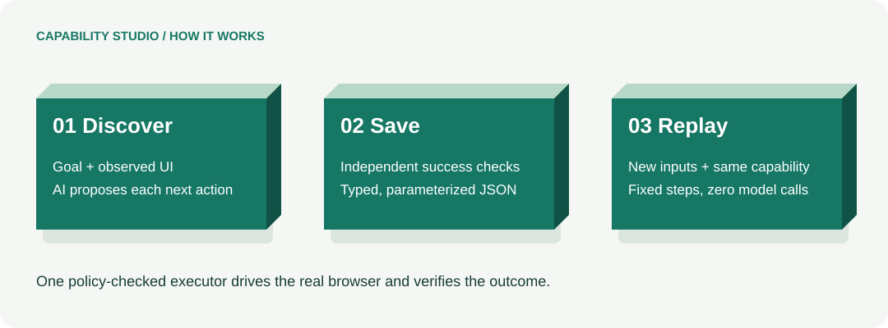

# Capability Studio: a reviewer’s first tour

**Give an AI agent hands in a business application that has no integration API. Discover a workflow once, save a typed capability, and replay it for new inputs without a model.**

Built by Manish Soni for interface.ai’s Computer-Use Automation System assignment. The target is **Harbor Ledger Bank**, a fictional application containing only synthetic records. This guide supplements the required [design report](../REPORT.md).



[Download the illustrated reviewer PDF](../output/pdf/capability-studio-reviewer-guide.pdf).

## The problem in plain terms

A bank employee may need to find a member, locate a card, enter replacement preferences, and check a review screen. When the vendor offers no usable business API, the available integration surface is the interface that staff click and type into. A developer can script that flow manually; an AI can instead discover its sequence from a goal and the current screen.

Using a model for every repeated request adds latency, cost, and variable decisions. This project uses the model during **discovery**, then saves the successful path as a parameterized capability. Ordinary code performs subsequent **replays**, checks the result, and stops deliberately when something unexpected happens.

“No API” means no business integration endpoint used by the automation. A website still uses HTTP internally to serve pages and accept forms. This engine operates those forms through a real browser; it does not call the bank’s business routes directly or import its records.

## What is running?

| Part | Purpose |
|---|---|
| Capability Studio, port 8766 | Operator dashboard: choose a goal, supply inputs, discover, replay, inspect results, and take over a paused session. |
| Harbor Ledger Bank, port 8767 | Separate synthetic banking website with member search and six servicing workflows. |
| Automation engine + browser adapter | Enforce policy, click/type/read the bank UI in Chromium, verify checkpoints, and return typed results. |
| Gemini adapter | During discovery only, send a masked observation and goal to Gemini and validate its proposed next action. |
| Capability JSON + evidence | Save parameter references, actions, checks, provenance, masked logs, and screenshots. |

The target app’s member/session data is in memory. Saved capabilities and masked evidence are files. There is no database. Restarting resets dashboard run history and target sessions; saved capabilities under `runs/web/` remain on disk.

## First successful run: no API key required

For a GitHub-hosted development environment, see [the private Codespaces launch option](HOSTING.md). The steps below run locally.

Install Python 3.12 and [uv](https://docs.astral.sh/uv/getting-started/installation/), then run:

```bash
git clone https://github.com/Maniss-ai/computer-use-capabilities.git
cd computer-use-capabilities
uv sync --locked --extra dev
export PLAYWRIGHT_BROWSERS_PATH="$PWD/.browser-cache"
uv run playwright install chromium
# Linux: use playwright install --with-deps chromium if system libraries are missing.
uv run capabilities web
```

1. Open [Capability Studio](http://127.0.0.1:8766/).
2. Select **Sub-account review**, then **Replay capability**.
3. Keep **Prepared sub-account review** as the saved capability. This bundled artifact came from a recorded genuine Gemini discovery.
4. Click **Member 10042**. Check Member ID = `10042`, Product = `Checking`, Account nickname = `Travel Fund`.
5. Keep Test scenario = **Normal workflow**, then click **Run capability**.
6. Expect **Success**, **Model calls = 0**, and **Review sub-account** in the banking preview.
7. Open **Result**. The three values must match your inputs and `review ready` must be `true`.
8. Open **Activity** for actions/checkpoints and **Capability** for the reusable JSON.

The final Create account button is intentionally not used. Success means **ready for review**, not that a banking request was submitted. Start a fresh run whenever you want to repeat the demonstration. The preview is the engine’s actual session, not an animation.

## Discover, then reuse your own capability

No manual demonstration on the banking website is needed. The AI receives the goal and observed controls, not an ordered sequence of clicks.

1. Configure `GEMINI_API_KEY=...` in an ignored local `.env` file, then restart the dashboard. Never commit the key. Replay does not need it.
2. Select **Sub-account review > Discover with AI > Gemini**.
3. Click **Member 10023**: `10023`, `Savings`, `Emergency Fund`. Keep **Normal workflow**.
4. Click **Discover and save**. Gemini proposes one action at a time; the executor checks permissions before acting. Allow a few minutes; provider latency and quota can vary.
5. On **Success**, verify the review values, nonzero model calls, and the new saved capability. The model’s “finish” request is independently checked against the UI before saving.
6. Click **Use this capability with new inputs**. Confirm the newly saved capability remains selected.
7. Click **Member 10042**, then **Run capability**. Expect `10042 / Checking / Travel Fund`, Success, and **zero model calls**.

One workflow can have several saved capabilities from separate discoveries. The library shows both workflow count and capability count. A fresh checkout bundles one sub-account capability; other saved capabilities appear after successful discovery in that workspace. The public evidence also contains card and dispute artifacts.

If discovery fails, inspect Result and Activity. A temporary model timeout/connection/service error may retry the undecided step within fixed limits. Authentication and quota failures stop. There is no silent paid-provider fallback. Failed discovery does not add a capability.

## Six workflows and exact inputs

All six prepare requests for review. They do not open accounts, block cards, issue refunds, change addresses, send documents, or waive fees.

For each workflow, use the **Member 10023** example for discovery and **Member 10042** for replay of the resulting capability. Those buttons fill every required field, including matching record references. See [Features and test cases](FEATURES_AND_TEST_CASES.md) for every field’s meaning and negative cases.

| Workflow | What it prepares | Member 10042 replay inputs, in addition to Member ID = 10042 |
|---|---|---|
| Sub-account review | A new savings/checking request | Product = `Checking`; Account nickname = `Travel Fund` |
| Card replacement | Replacement preferences for a member-owned card | Card reference = `CARD-10042`; Replacement reason = `Lost`; Replacement delivery = `Registered address` |
| Transaction dispute | A payment investigation intake | Transaction reference = `TXN-10042`; Dispute reason = `Service not received`; Contact channel = `Phone` |
| Address change | A mailing address and verification route | Street address = `280 Pine Avenue`; City = `Austin`; State code = `TX`; Postal code = `78701`; Verification method = `Callback verification` |
| Statement request | A statement period, format, and delivery request | Account reference = `ACC-10042`; Statement period = `August 2026`; Document format = `Paper copy`; Document delivery = `Branch collection` |
| Fee adjustment | A fee review request | Fee reference = `FEE-10042`; Adjustment reason = `Service issue`; Requested resolution = `Partial waiver`; Supporting note = `Service issue reported to branch` |

Available members: **10023 (Jordan Ellis), 10042 (Morgan Chen), 10077 (Avery Patel)**. References use the same member suffix. `99999` is a valid-format missing member. `123` is invalid input. These are fixed fictional fixtures, not real customer accounts.

## Demonstrate an exception and real human takeover

Keep **Replay capability**, a saved sub-account capability, `10042 / Checking / Travel Fund`.

| Test | Change | Expected behavior | What it proves |
|---|---|---|---|
| Missing member | Member ID = `99999`; Normal workflow | Outcome: `member_not_found`; no review | A business answer is different from a crash. |
| Known notice | Test scenario = Known notice | Notice dismissed, Success, zero model calls | Declared recovery does not invoke an AI. |
| Permission denied | Test scenario = Permission denied | Stopped with a permission failure | Automation respects access limits. |
| Human takeover | Test scenario = Session expired | Needs you, then manual restore and resumed replay | Control moves to a person in the same browser session. |

For takeover: click **Claim session**, click **Restore session inside the live banking preview**, then **Return to automation**. Expect Success and zero model calls. Control ownership and an incrementing epoch prevent the human and automation from acting concurrently. Returning control rechecks the screen before continuing.

**Open manual sandbox** creates an independent browsing session. It is useful for exploring the website, but actions there neither train the model nor repair the engine’s paused session. Use the live preview for takeover.

## Evidence and evaluation map

| Assignment requirement | Where to inspect |
|---|---|
| Genuine goal-driven UI discovery | [Live discovery events](../evidence/live/discover-2acef308bd9c/events.jsonl), with provider response IDs, actions, and verified completion |
| Typed, versioned, reusable artifact | [Generated capability](../evidence/live/discover-2acef308bd9c/capability.json) and [JSON Schema](../schemas/capability.schema.json) |
| Deterministic replay with new inputs | [Matching replay](../evidence/live/replay-ac60b915dc4f/events.jsonl): same artifact hash and zero model calls |
| Business outcomes and bounded recovery | [Offline evidence](../evidence/offline/manifest.json), clearly labeled scripted planner/operator fixtures |
| Same-session human handoff | [Session-expiry evidence](../evidence/offline/handoff-expired-session/events.jsonl) and browser integration tests |
| Policy and data handling | `policy.py`, `surface.py`, `evidence.py`, and Safety in [REPORT.md](../REPORT.md) |
| Heterogeneity and tenant reuse | Surface protocol and Heterogeneity & multi-tenant in [REPORT.md](../REPORT.md); desktop and multi-tenant runtime are design extensions |
| Reproducible checks | `make verify`, `make submission-check`, [GitHub Actions](https://github.com/Maniss-ai/computer-use-capabilities/actions) |

Latest local acceptance: **141 tests passed**, lint/format/strict typing passed, and the genuine discovery + matching replay evidence gate passed. The [verification record](../evidence/verification.json) identifies the measured scope.

All six workflows have real-browser tests using scripted planners. Genuine Gemini discovery plus matching replay is recorded for **sub-account, card replacement, and transaction dispute**. Address, statement, and fee paths do not yet have successful live-model evidence. Provider failures are retained; this is not a discovery reliability benchmark.

The latest sub-account confirmation used **7 model calls / 86.2 seconds** for discovery and **0 calls / 5.3 seconds** for replay. These are individual observations, not performance promises. That successful live run needed no retry; transient-failure recovery is tested separately by fault injection.

## Hosting and scope

The [public repository](https://github.com/Maniss-ai/computer-use-capabilities) can host code, this guide, the PDF, and evidence. **GitHub Pages cannot execute these Python servers or Chromium**; it can host static documentation only. See [GitHub’s Pages documentation](https://docs.github.com/en/pages/getting-started-with-github-pages/creating-a-github-pages-site).

GitHub Codespaces can run server processes and forward ports, but it is a development environment with account/usage requirements, not permanent public hosting. A persistent public demo requires a separate server host and authenticated access to the control panel. This local prototype is not advertised as an already deployed public service.

The current console is single-user and loopback-only, with CSRF/origin checks. There is one active run at a time. Production authentication, desktop drivers, durable distributed sessions, and a tenant registry are intentional cuts. A model-free replay can still fail if the app rejects the request or its UI no longer matches; it reports the condition instead of inventing new steps.

**Recommended reviewer path:** run the no-key replay, try a missing member and takeover, inspect one live artifact/replay pair, then read the seven-section design report. This establishes the core before exploring additional workflows.
